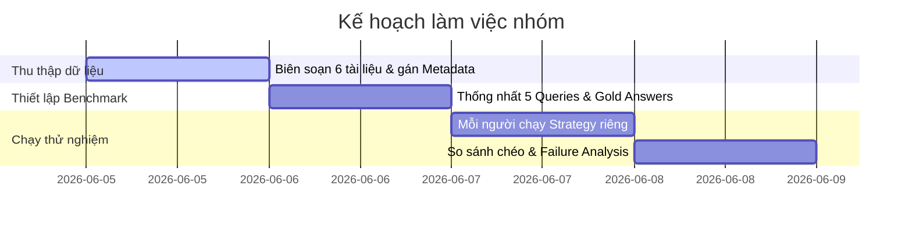

# Kế hoạch Triển khai (Phần Việc Nhóm - 6 Thành Viên)

Kế hoạch này phân chia cụ thể công việc cho 6 thành viên trong nhóm để hoàn thành Phase 2 của Lab 7.

## Thông tin chung của Nhóm

- **Domain được chọn:** Quy chế học vụ & Quy trình/Tuyển sinh Đại học (Academic Regulations & University SOPs/FAQs).
- **Số lượng thành viên:** 6 thành viên (được ký hiệu từ Thành viên 1 đến 6).

---

## Phân công Nhiệm vụ Chi tiết

### 👤 Thành viên 1 (Bạn / User)
- **Chuẩn bị tài liệu:** Thu thập và biên soạn tài liệu `data/canh_bao_hoc_vu_quy_che.md` (nội dung quy chế cảnh báo học vụ, buộc thôi học).
- **Chiến lược Chunking:** Triển khai **Custom Strategy** (Cắt văn bản dựa theo tiêu đề Markdown `#`, `##` để giữ trọn vẹn nội dung của từng mục quy chế).
- **Benchmark Query:** Biên soạn **Query 1** liên quan đến quy trình đăng ký môn học và kết quả mong đợi.
- **Tổng hợp:** Phân tích các lỗi thu hồi (Failure Analysis) của cả nhóm ở cuối bài tập.

### 👤 Thành viên 2
- **Chuẩn bị tài liệu:** Thu thập và biên soạn tài liệu `data/dang_ky_mon_hoc_sop.md` (hướng dẫn quy trình đăng ký môn học, số tín chỉ tối thiểu/tối đa).
- **Chiến lược Chunking:** Sử dụng `SentenceChunker` với tham số `max_sentences_per_chunk=5` (phù hợp với các đoạn hướng dẫn quy trình dài).
- **Benchmark Query:** Biên soạn **Query 2** liên quan đến các mức cảnh báo học vụ và buộc thôi học.

### 👤 Thành viên 3
- **Chuẩn bị tài liệu:** Thu thập và biên soạn tài liệu `data/tuyen_sinh_faq.md` (bộ câu hỏi thường gặp về phương thức tuyển sinh, điểm chuẩn).
- **Chiến lược Chunking:** Sử dụng `SentenceChunker` với tham số `max_sentences_per_chunk=2` (phù hợp với dạng Hỏi - Đáp cực ngắn).
- **Benchmark Query:** Biên soạn **Query 3** liên quan đến điều kiện tuyển sinh và nhập học.

### 👤 Thành viên 4
- **Chuẩn bị tài liệu:** Thu thập và biên soạn tài liệu `data/hoc_phi_huong_dan.md` (quy trình đóng học phí, chính sách miễn giảm, gia hạn học phí).
- **Chiến lược Chunking:** Sử dụng `RecursiveChunker` với tham số `chunk_size=300, overlap=30` (phù hợp với các bảng thông tin học phí nhỏ).
- **Benchmark Query:** Biên soạn **Query 4** liên quan đến thời hạn đóng học phí và chính sách gia hạn.

### 👤 Thành viên 5
- **Chuẩn bị tài liệu:** Thu thập và biên soạn tài liệu `data/khao_thi_quy_che.md` (quy chế thi cử, điều kiện hoãn thi, thủ tục phúc khảo bài thi).
- **Chiến lược Chunking:** Sử dụng `RecursiveChunker` với tham số `chunk_size=800, overlap=100` (đảm bảo giữ nguyên các phần phân tích quy chế kiểm tra phức tạp).
- **Benchmark Query:** Biên soạn **Query 5** (yêu cầu nâng cao về lọc metadata, ví dụ: quy định thi cử áp dụng riêng cho môn thực hành/đồ án).

### 👤 Thành viên 6
- **Chuẩn bị tài liệu:** Thu thập và biên soạn tài liệu `data/tot_nghiep_quy_trinh.md` (quy trình xét tốt nghiệp, hồ sơ nhận bằng và phát chứng chỉ).
- **Chiến lược Chunking:** Sử dụng `FixedSizeChunker` với tham số `chunk_size=400, overlap=50` (để làm Baseline so sánh).
- **Điều phối Benchmark:** Tạo script chung chạy thử tất cả 5 query của nhóm trên các store tương ứng để thu thập kết quả điểm chính xác (retrieval score) và so sánh chéo giữa các chiến lược.

---

## Kế hoạch Thực hiện

## Kết quả đầu ra mong đợi của Nhóm
1. Thư mục `data/` chứa đầy đủ 6 tài liệu quy chế đại học dạng `.md`.
2. Bảng so sánh hiệu quả tìm kiếm giữa các chiến lược (Baseline vs Custom) được điền đầy đủ thông số.
3. Phân tích ít nhất 1 trường hợp tìm kiếm thất bại để đề xuất giải pháp tối ưu.
